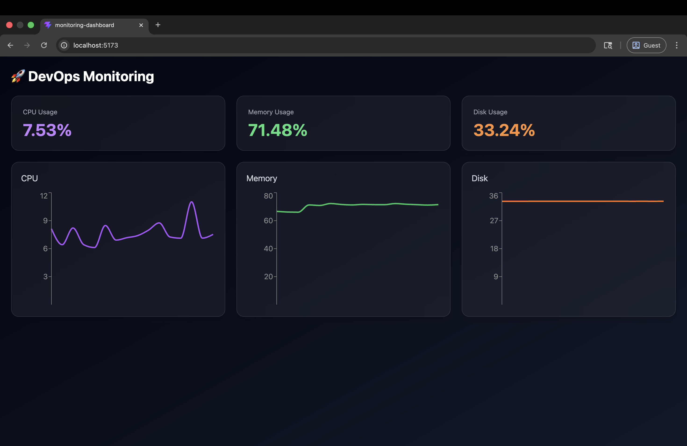

# 🚀 DevOps Monitoring Dashboard (Mini Datadog)

A full-stack **DevOps monitoring system** that collects real-time metrics from servers and visualizes them in a modern dashboard.

---

## 🧠 Overview

This project replicates core concepts of tools like **Datadog / Grafana**:

* 🖥️ Agent runs on EC2 (or any server)
* 📡 Collects system + Docker metrics
* 🔄 Sends data to Supabase (local)
* 📊 React dashboard visualizes data in real-time

---

## 🏗️ Architecture

```
EC2 Server (Docker Agent)
        ↓
   SSH Reverse Tunnel
        ↓
 Local Supabase (Postgres)
        ↓
 React Dashboard (Vite + Tailwind)
```

---

## ⚙️ Features

### 🔍 Monitoring

* CPU usage
* Memory usage
* Disk usage
* Docker container status

### 📊 Dashboard

* Modern dark UI (Tailwind)
* Live updating charts
* Global chart toggle (Line / Bar)
* Stat cards (CPU, Memory, Disk)

### 🚨 Alerts (basic)

* CPU threshold alerts
* Stored in database

---

## 🧱 Tech Stack

### Backend / Agent

* Node.js
* Docker
* `systeminformation`
* `dockerode`

### Database / API

* Supabase (Postgres + REST)

### Frontend

* React (Vite)
* Tailwind CSS
* Recharts

---

## 🚀 Setup Guide

---

### 1️⃣ Supabase (Local)

```bash
npx supabase init
npx supabase start
```

Access:

* API → http://localhost:54321
* Studio → http://localhost:54323

---

### 2️⃣ Database Schema

Run in SQL Editor:

```sql
create table metrics (
  id bigint generated always as identity primary key,
  server_id text,
  cpu_usage float,
  memory_usage float,
  disk_usage float,
  created_at timestamp default now()
);

create table containers (
  id bigint generated always as identity primary key,
  server_id text,
  container_name text,
  status text,
  created_at timestamp default now()
);

create table alerts (
  id bigint generated always as identity primary key,
  server_id text,
  type text,
  message text,
  created_at timestamp default now()
);
```

---

### 3️⃣ SSH Tunnel (Local → EC2)

```bash
ssh -i "your-key.pem" \
-R 0.0.0.0:54321:localhost:54321 \
ubuntu@your-ec2-ip
```

---

### 4️⃣ Monitoring Agent (EC2)

Run container:

```bash
docker run -d \
  --name monitor-agent \
  --restart unless-stopped \
  --network host \
  -v /var/run/docker.sock:/var/run/docker.sock \
  --env-file .env \
  monitor-agent
```

---

### 5️⃣ Environment Variables

```
SUPABASE_URL=http://localhost:54321
SUPABASE_KEY=your_publishable_key
SERVER_ID=your-server-id
```

---

### 6️⃣ Frontend Dashboard

```bash
npm install
npm run dev
```

Open:
👉 http://localhost:5173

---

## 📊 Dashboard Features

* 📈 CPU / Memory / Disk charts
* 🔄 Auto-refresh (every 5 seconds)
* 🎛 Global toggle (Line ↔ Bar)
* 🧊 Modern glass UI
* 📦 Container monitoring (optional)

---

## 🔄 Data Flow

1. Agent collects metrics every 30 sec
2. Sends data → Supabase
3. React fetches data every 5 sec
4. UI updates charts dynamically

---

## ⚠️ Important Fix (Live Data Issue)

To always fetch latest data:

```js
.order("created_at", { ascending: false })
.limit(50)
```

Then:

```js
setMetrics(data.reverse());
```

---

## 🔐 Security Notes

* Use **publishable key (safe for frontend)**
* Do NOT expose `service_role` key
* SSH tunnel prevents public exposure

---

## ⚠️ Known Limitations

* Supabase runs locally (not production)
* Polling-based updates (not realtime yet)
* No authentication

---

## 🚀 Future Improvements

* ⚡ Realtime updates (Supabase subscriptions)
* 🔔 Email / Slack alerts
* 🌍 Multi-server monitoring
* 📅 Time filters (5m, 1h, 24h)
* 🔐 Authentication (JWT / Supabase Auth)
* ☁️ Deploy Supabase to cloud

---

## 💡 Key Learnings

* Docker networking issues (`host.docker.internal`, `host network`)
* SSH reverse tunneling
* Supabase API usage
* Real-time system design
* Frontend data visualization

---

## 📸 Screenshots



---

## 🧑‍💻 Author

Ashutosh Singh
DevOps Engineer 🚀

---

## ⭐ Inspiration

* Datadog
* Grafana
* Prometheus

---

## 📌 Conclusion

This project demonstrates:

✔️ End-to-end DevOps system
✔️ Observability pipeline
✔️ Full-stack development
✔️ Real-world debugging

---

⭐ Star this repo if you found it useful!
